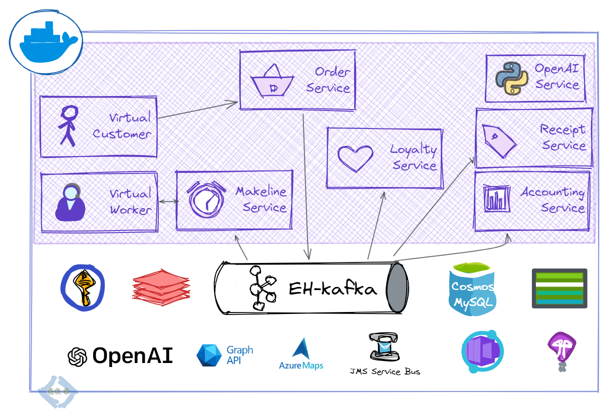

# reddog-code-spring

### Background

This repo, based on [reddog-code](https://github.com/Azure/reddog-code), is a deep-dive for Quarkus developers on Azure hosting options and idiomatic java sdks that integrate with managed backing services. Using a retail scenario that depicts a typical event-driven microservices architecture, this codebase (and associated lab) will ease the migration and modernization of Quarkus workloads on Azure. This repo also highlights usage of our emergent services such as [Az Cognitive Services](https://azure.microsoft.com/en-us/products/cognitive-services/#overview), [OpenAI](https://azure.microsoft.com/en-us/products/cognitive-services/openai-service/), and [HuggingFace](https://azure.microsoft.com/en-us/solutions/hugging-face-on-azure/#overview) to transform enterprise applications with Azure AI offerings. In addition, with code, it shows usage of our offerings in preview such as the latest [JFR for Application Insights](https://learn.microsoft.com/en-us/azure/azure-monitor/app/java-standalone-profiler) that uses Machine Learning for insightful performance diagnostics, [passwordless connections](https://learn.microsoft.com/en-us/azure/storage/common/multiple-identity-scenarios?toc=%2Fazure%2Fdeveloper%2Fintro%2Ftoc.json&bc=%2Fazure%2Fdeveloper%2Fintro%2Fbreadcrumb%2Ftoc.json&tabs=java) to services using [managed identities](https://learn.microsoft.com/en-us/azure/active-directory/managed-identities-azure-resources/overview), and [JMS 2.0 API](https://learn.microsoft.com/en-us/azure/service-bus-messaging/how-to-use-java-message-service-20) with Azure Service Bus.

### Setup:

Jump over to the docs to get started.

[Initial setup docs](docs/initial-setup.md)

### Services and local port mappings

| Service            | Description                | Key dependencies | port |
| ------------------ | -------------------------- | ---------------- | ---- |
| Virtual Customer   | Simulates orders           |                  | 8081 |
| Order Service      | Place and manage orders    | smallrye         | 8082 |
| Loyalty Service    | Manage reward points       |                  | 8083 |
| Makeline Service   | Fulfil order queue         |                  | 8084 |
| Receipt generation | Archive receipts           |                  | 8085 |
| Virtual Worker     | Simulate order completion  |                  | 8086 |
| Accounting Service | Process and transform data |                  | 8087 |
| nn-bindings        | GPT-3 responses to prompts |                  | 8000 |

### Contributing

This project welcomes contributions and suggestions.  Most contributions require you to agree to a
Contributor License Agreement (CLA) declaring that you have the right to, and actually do, grant us
the rights to use your contribution. For details, visit https://cla.opensource.microsoft.com.

When you submit a pull request, a CLA bot will automatically determine whether you need to provide
a CLA and decorate the PR appropriately (e.g., status check, comment). Simply follow the instructions
provided by the bot. You will only need to do this once across all repos using our CLA.

This project has adopted the [Microsoft Open Source Code of Conduct](https://opensource.microsoft.com/codeofconduct/).
For more information see the [Code of Conduct FAQ](https://opensource.microsoft.com/codeofconduct/faq/) or
contact [opencode@microsoft.com](mailto:opencode@microsoft.com) with any additional questions or comments.

:warning: :construction: Java version of [reddog-code](https://github.com/Azure/reddog-code) for [Azure Spring Apps (ASA)](https://docs.microsoft.com/en-us/azure/spring-apps/) and [App Service](https://docs.microsoft.com/en-us/azure/app-service/) is WIP